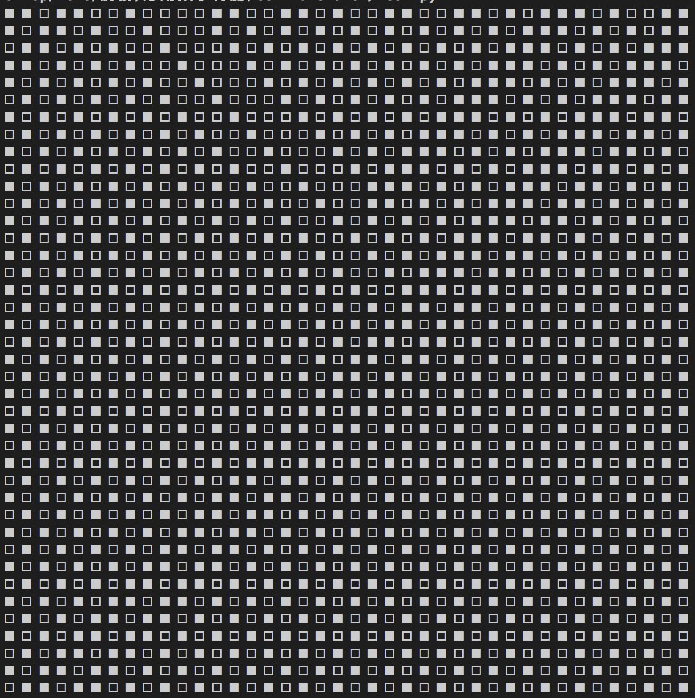

# CellAutomaton
セルオートマトンのシミュレーションシステム

# Usage
test.pyを実行すると、交通流のシミュレーションを行える。
test_typeを切り替えることで、交通流経路の分岐の有無を変更可能。
分岐ありの場合、printtypeを変更することで、表示範囲を選択できる。

# Demo
例1:test_type=0, ring_size=40, car_num=21

例2:test_type=1, ring_size=10, alt_size=2, car_num=7, branch_index=2, connecting_index=5

# References
[超離散 Allen-Cahn 方程式](http://www.kurims.kyoto-u.ac.jp/~kyodo/kokyuroku/contents/pdf/1796-20.pdf) 村田 実貴生

[セルオートマトンによる交通流と渋滞現象の研究](http://www.gem.aoyama.ac.jp/~kyo/sotsuken/2010/obuchi_sotsuron_2010.pdf) 小渕 伊織
